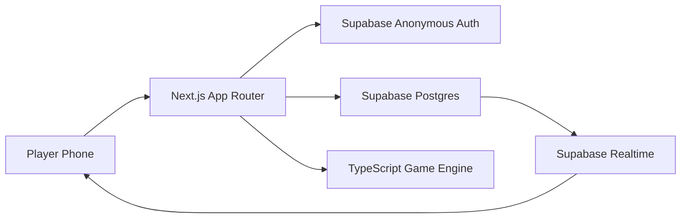
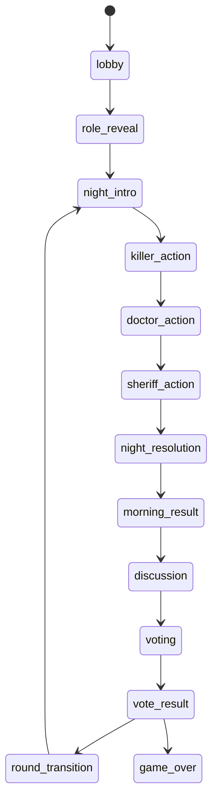

# Architecture

## Overview

`WHO'S THE KILLER?` is a Next.js application backed by Supabase. Clients render mobile-first screens and submit intent. Server-side code and database policies are responsible for authorization, privacy, phase progression, and game resolution.

## Frontend

The app uses the App Router under `src/app`. Reusable UI belongs in `src/components`. The first page is a PWA-ready, mobile-first product shell with a deterministic demo scenario.

## Backend

Supabase stores rooms, players, private roles, night actions, sheriff results, votes, and public game events. Browser clients subscribe only to public state. Trusted server logic should call the engine helpers in `src/game/engine.ts` before writing private or authoritative records.

## Authentication

Players use Supabase anonymous auth. The anonymous user id is the security identity for membership, readiness, private role reads, private sheriff result reads, votes, and reconnects.

## Authorization And Secret Boundaries

- `players` is public to room members but contains no role.
- `player_roles` is readable only by the owning player.
- `sheriff_results` is readable only by the owning Sheriff player.
- `night_actions` is not selectable by browser clients.
- `game_events.public_payload` must not include secret roles or targets.

## State Machine

## Dead Role Illusion

Doctor and Sheriff phases continue even when those roles are dead. The alive role can act privately; a dead role cannot act, but the public phase remains visible with safe timing so role death is not leaked.

## Realtime

Realtime should publish room phase changes, public player presence/readiness, votes where safe, and public events. Private role data, night targets, and sheriff results must use direct authorized reads instead of public subscriptions.

## Reconnect Strategy

The anonymous auth session identifies returning players. On load, the client should rehydrate room membership, public room state, and the current player's private role/result data where authorized.

## Failure Modes

- Duplicate names are rejected by a unique index.
- Duplicate actions and votes are rejected by unique indexes and engine checks.
- Wrong-phase, wrong-role, dead-player, and invalid-target actions are rejected by trusted logic.
- Expired rooms are modeled with `expires_at` for cleanup jobs.

## PWA

`src/app/manifest.webmanifest` defines install behavior. Keep role names out of URLs, browser titles for private screens, notifications, and metadata.
